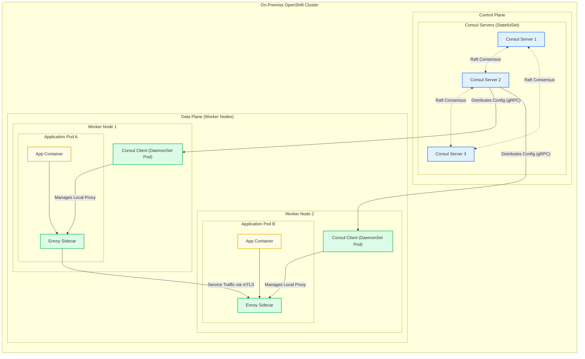
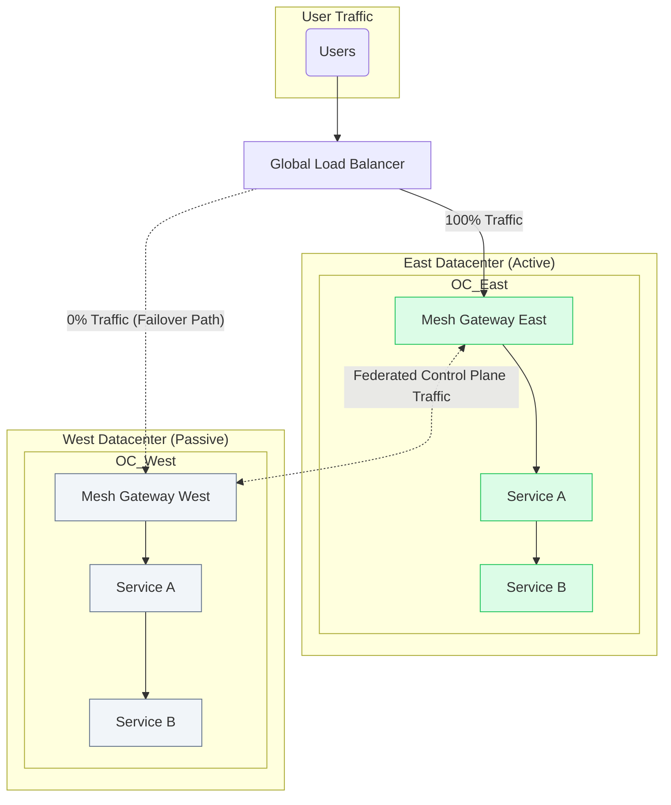
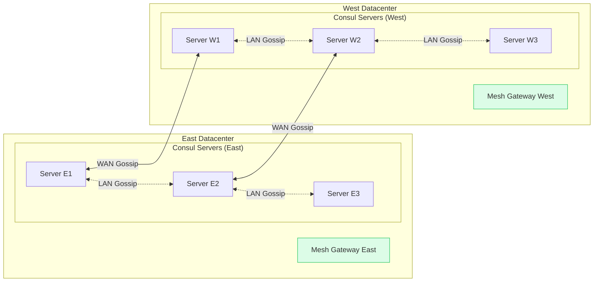
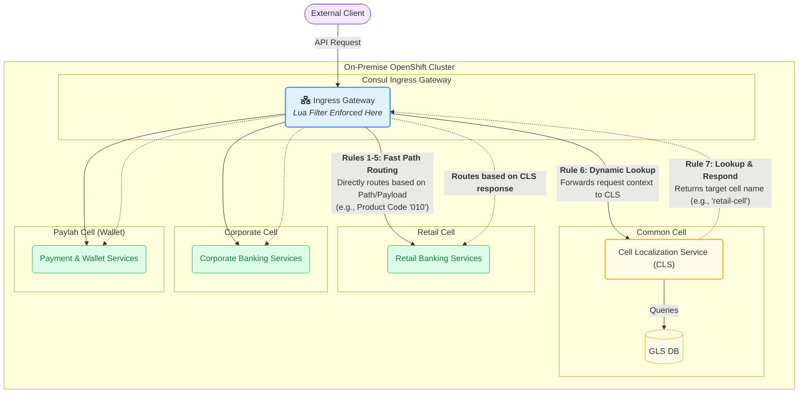

# ServiceMesh # ServiceMesh# ServiceMesh # ServiceMesh

```mermaid 
graph TD
    subgraph "On-Premise OpenShift Cluster"
        direction TB

        subgraph "Control Plane"
            subgraph "Consul Servers (StatefulSet)"
                S1["Consul Server 1"]
                S2["Consul Server 2"]
                S3["Consul Server 3"]
            end
            S1 <-.->|"Raft Consensus"| S2
            S2 <-.->|"Raft Consensus"| S3
            S3 <-.->|"Raft Consensus"| S1
        end

        subgraph "Data Plane (Worker Nodes)"
            direction LR
            subgraph "Worker Node 1"
                C1["Consul Client (DaemonSet Pod)"]
                subgraph "Application Pod A"
                    App1["App Container"] --> E1["Envoy Sidecar"]
                end
            end

            subgraph "Worker Node 2"
                C2["Consul Client (DaemonSet Pod)"]
                subgraph "Application Pod B"
                    App2["App Container"] --> E2["Envoy Sidecar"]
                end
            end
        end

        %% Define Interactions
        S2 -- "Distributes Config (gRPC)" --> C1
        S2 -- "Distributes Config (gRPC)" --> C2
        C1 -- "Manages Local Proxy" --> E1
        C2 -- "Manages Local Proxy" --> E2
        E1 -- "Service Traffic via mTLS" --> E2
    end

    %% Define Styles
    classDef controlPlane fill:#e0f2fe,stroke:#3b82f6,stroke-width:2px
    classDef dataPlane fill:#dcfce7,stroke:#22c55e,stroke-width:2px
    classDef appPod fill:#fefce8,stroke:#eab308,stroke-width:2px
    class S1,S2,S3 controlPlane
    class C1,C2,E1,E2 dataPlane
    class App1,App2 appPod

```

```mermaid
graph TD
    subgraph "User Traffic"
        U(Users)
    end

    GLB[Global Load Balancer]

    subgraph "East Datacenter (Active)"
        OC_East["OpenShift Cluster (East)"]
        subgraph OC_East
          MGE[Mesh Gateway East]
          ServiceA_East["Service A"]
          ServiceB_East["Service B"]
        end
    end

    subgraph "West Datacenter (Passive)"
      OC_West["OpenShift Cluster (West)"]
      subgraph OC_West
        MGW[Mesh Gateway West]
        ServiceA_West["Service A"]
        ServiceB_West["Service B"]
      end
    end

    U --> GLB
    GLB -- "100% Traffic" --> MGE
    GLB -.->|"0% Traffic (Failover Path)"| MGW
    MGE --> ServiceA_East --> ServiceB_East
    MGW --> ServiceA_West --> ServiceB_West
    MGE <-.->|"Federated Control Plane Traffic"| MGW

    classDef active fill:#dcfce7,stroke:#22c55e
    classDef passive fill:#f1f5f9,stroke:#64748b
    class MGE,ServiceA_East,ServiceB_East active
    class MGW,ServiceA_West,ServiceB_West passive

```

```mermaid

graph LR
    subgraph "East Datacenter"
        direction TB
        subgraph "Consul Servers (East)"
            S_E1["Server E1"]
            S_E2["Server E2"]
            S_E3["Server E3"]
        end
        S_E1 <-.->|"LAN Gossip"| S_E2
        S_E2 <-.->|"LAN Gossip"| S_E3
        MGE[Mesh Gateway East]
    end

    subgraph "West Datacenter"
        direction TB
        subgraph "Consul Servers (West)"
            S_W1["Server W1"]
            S_W2["Server W2"]
            S_W3["Server W3"]
        end
        S_W1 <-.->|"LAN Gossip"| S_W2
        S_W2 <-.->|"LAN Gossip"| S_W3
        MGW[Mesh Gateway West]
    end

    S_E1 <-->|"WAN Gossip"| S_W1
    S_E2 <-->|"WAN Gossip"| S_W2

    %% Define RPC Forwarding for cross-datacenter query
    style MGE fill:#dcfce7,stroke:#22c55e
    style MGW fill:#dcfce7,stroke:#22c55e

```

```mermaid
graph TD
    %% Define the main actors and entry point
    Client([External Client]) -- "API Request" --> IngressGateway;

    %% Define the main cluster boundary
    subgraph "On-Premise OpenShift Cluster"
        %% Ingress Gateway is the edge component
        subgraph "Consul Ingress Gateway"
            IngressGateway("fa:fa-network-wired Ingress Gateway<br/><i>Lua Filter Enforced Here</i>");
        end

        %% Define the logical cells
        subgraph "Common Cell"
            CLS("Cell Localization Service (CLS)");
            GLS_DB[(GLS DB)];
            CLS -- "Queries" --> GLS_DB;
        end

        subgraph "Retail Cell"
            RetailServices("Retail Banking Services");
        end

        subgraph "Corporate Cell"
            CorporateServices("Corporate Banking Services");
        end

        subgraph "Paylah Cell (Wallet)"
            PaylahServices("Payment & Wallet Services");
        end

        %% Define the routing logic flows from the Gateway
        IngressGateway -- "<b>Rules 1-5: Fast Path Routing</b><br/>Directly routes based on Path/Payload<br/>(e.g., Product Code '010')" --> RetailServices;
        IngressGateway -- " " --> CorporateServices;
        IngressGateway -- " " --> PaylahServices;

        IngressGateway -- "<b>Rule 6: Dynamic Lookup</b><br/>Forwards request context to CLS" --> CLS;
        CLS -.->|"<b>Rule 7: Lookup & Respond</b><br/>Returns target cell name (e.g., 'retail-cell')"| IngressGateway;

        %% Final routing after dynamic lookup
        IngressGateway -.->|"<b>Routes based on CLS response</b>"| RetailServices;
        IngressGateway -.->|" "| CorporateServices;
        IngressGateway -.->|" "| PaylahServices;
    end

    %% Styling
    style Client fill:#f3e8ff,stroke:#8b5cf6
    style IngressGateway fill:#e0f2fe,stroke:#3b82f6,stroke-width:2px
    style CLS fill:#fefce8,stroke:#eab308,stroke-width:2px
    style GLS_DB fill:#fefce8,stroke:#eab308
    classDef cell fill:#dcfce7,stroke:#22c55e,stroke-width:1px,color:#15803d
    class RetailServices,CorporateServices,PaylahServices cell
```
