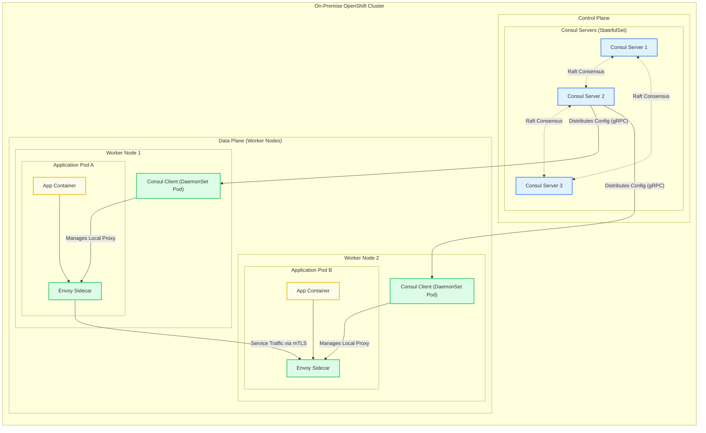
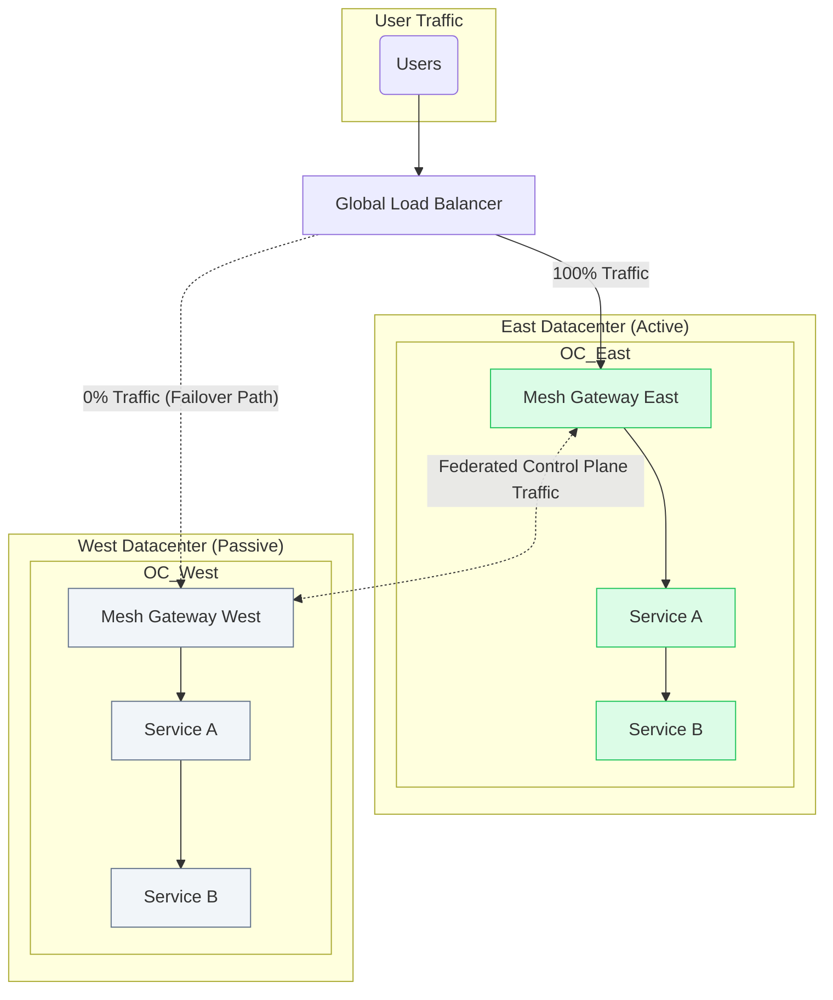

# ServiceMesh # ServiceMesh# ServiceMesh # ServiceMesh

```mermaid 
graph TD
    subgraph "On-Premise OpenShift Cluster"
        direction TB

        subgraph "Control Plane"
            subgraph "Consul Servers (StatefulSet)"
                S1["Consul Server 1"]
                S2["Consul Server 2"]
                S3["Consul Server 3"]
            end
            S1 <-.->|"Raft Consensus"| S2
            S2 <-.->|"Raft Consensus"| S3
            S3 <-.->|"Raft Consensus"| S1
        end

        subgraph "Data Plane (Worker Nodes)"
            direction LR
            subgraph "Worker Node 1"
                C1["Consul Client (DaemonSet Pod)"]
                subgraph "Application Pod A"
                    App1["App Container"] --> E1["Envoy Sidecar"]
                end
            end

            subgraph "Worker Node 2"
                C2["Consul Client (DaemonSet Pod)"]
                subgraph "Application Pod B"
                    App2["App Container"] --> E2["Envoy Sidecar"]
                end
            end
        end

        %% Define Interactions
        S2 -- "Distributes Config (gRPC)" --> C1
        S2 -- "Distributes Config (gRPC)" --> C2
        C1 -- "Manages Local Proxy" --> E1
        C2 -- "Manages Local Proxy" --> E2
        E1 -- "Service Traffic via mTLS" --> E2
    end

    %% Define Styles
    classDef controlPlane fill:#e0f2fe,stroke:#3b82f6,stroke-width:2px
    classDef dataPlane fill:#dcfce7,stroke:#22c55e,stroke-width:2px
    classDef appPod fill:#fefce8,stroke:#eab308,stroke-width:2px
    class S1,S2,S3 controlPlane
    class C1,C2,E1,E2 dataPlane
    class App1,App2 appPod

```

```mermaid
graph TD
    subgraph "User Traffic"
        U(Users)
    end

    GLB[Global Load Balancer]

    subgraph "East Datacenter (Active)"
        OC_East["OpenShift Cluster (East)"]
        subgraph OC_East
          MGE[Mesh Gateway East]
          ServiceA_East["Service A"]
          ServiceB_East["Service B"]
        end
    end

    subgraph "West Datacenter (Passive)"
      OC_West["OpenShift Cluster (West)"]
      subgraph OC_West
        MGW[Mesh Gateway West]
        ServiceA_West["Service A"]
        ServiceB_West["Service B"]
      end
    end

    U --> GLB
    GLB -- "100% Traffic" --> MGE
    GLB -.->|"0% Traffic (Failover Path)"| MGW
    MGE --> ServiceA_East --> ServiceB_East
    MGW --> ServiceA_West --> ServiceB_West
    MGE <-.->|"Federated Control Plane Traffic"| MGW

    classDef active fill:#dcfce7,stroke:#22c55e
    classDef passive fill:#f1f5f9,stroke:#64748b
    class MGE,ServiceA_East,ServiceB_East active
    class MGW,ServiceA_West,ServiceB_West passive

```
