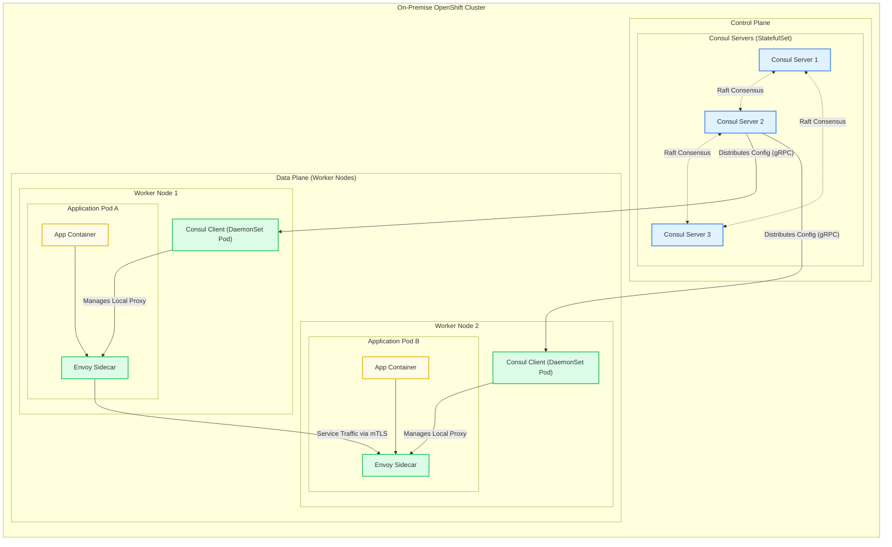
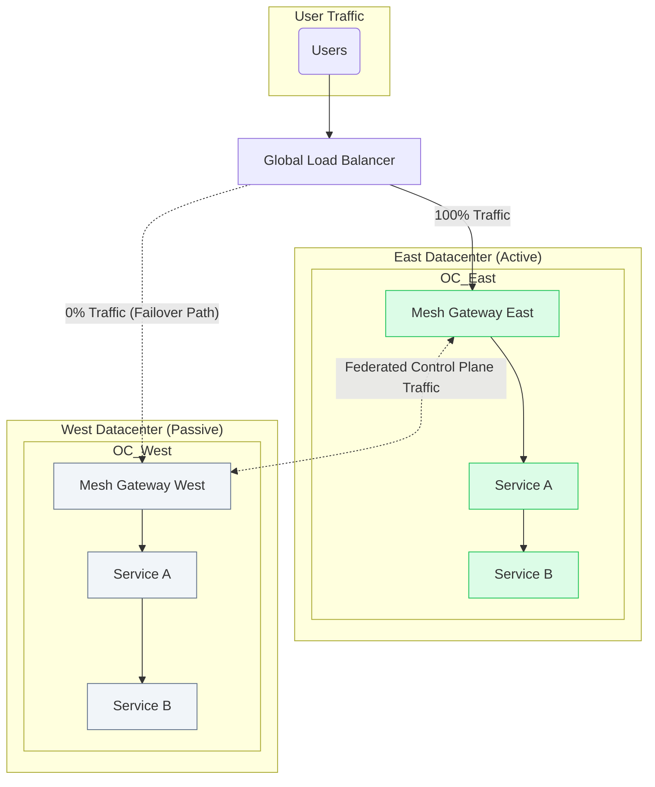
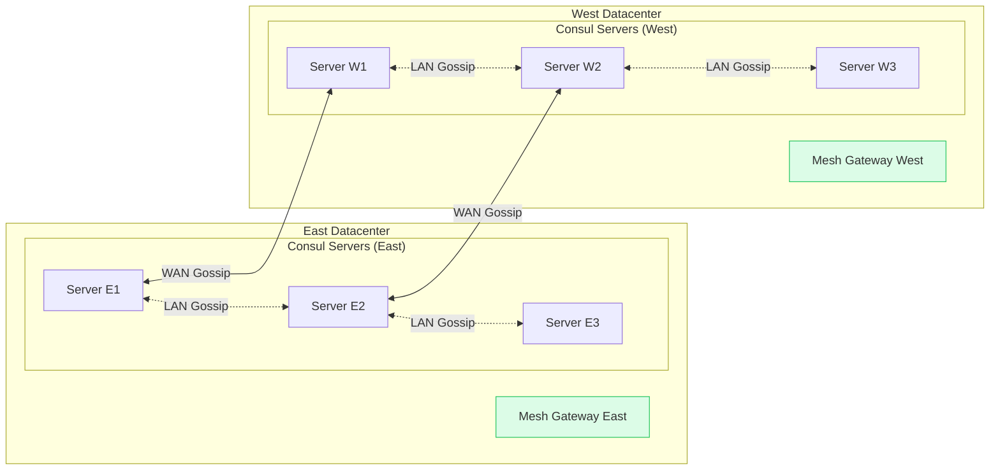
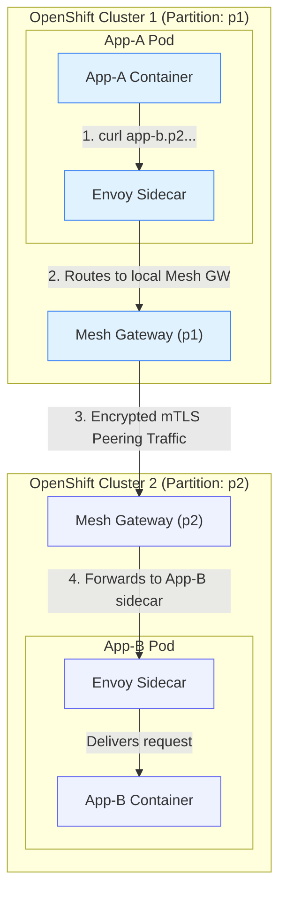
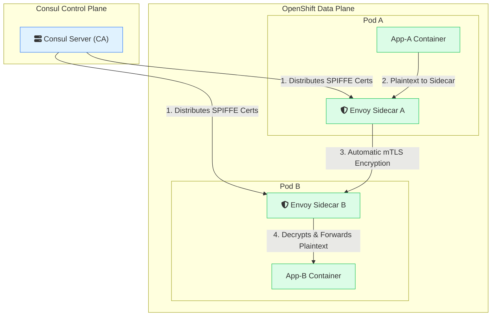
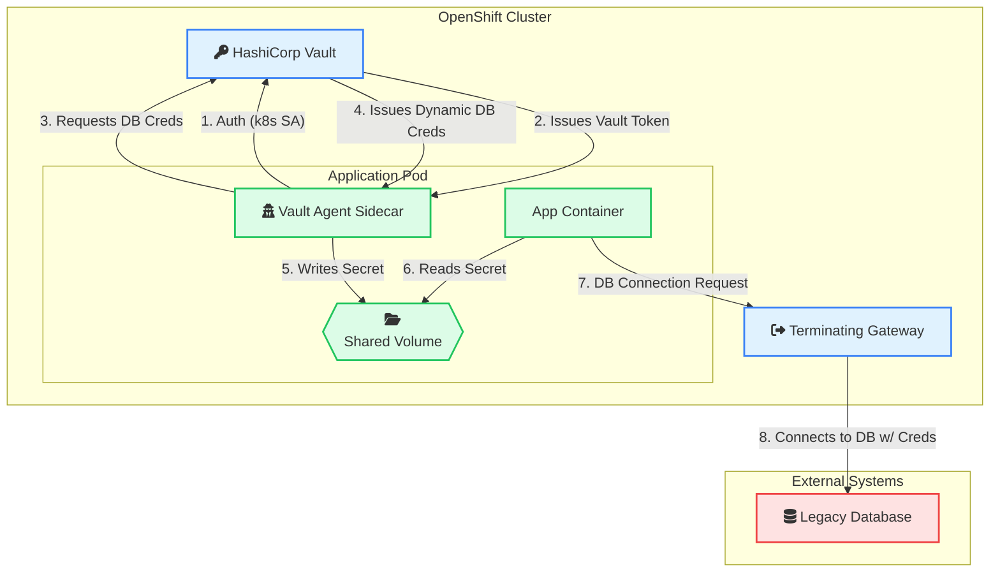

Implementing a Service Mesh for a Core Banking Cell-Based Architecture with Consul
Overview: The Need for a Service Mesh in a Cell-Based Architecture
Modernizing a core banking platform often involves adopting a Cell-Based Architecture. This pattern segregates services into logical, domain-oriented "cells" (e.g., Retail, Corporate, Payments, and a Common cell for shared services) which can be deployed and scaled independently, often across multiple on-premise OpenShift clusters for high availability and disaster recovery.

This distributed architecture introduces significant networking and security challenges:

How do we intelligently route traffic to the correct cell based on complex business logic?

How do we enforce strict security boundaries, ensuring services in one cell cannot improperly access another?

How do we maintain a global, real-time registry of all services across all cells and datacenters?

How can we encrypt all communication between services automatically?

How do we ensure the entire system is resilient to failures within a cell or an entire datacenter?

This document outlines the architecture for solving these challenges by implementing HashiCorp Consul as a service mesh. Consul provides a consistent control plane for networking, security, and resiliency across the entire cell-based platform running on OpenShift.

The Role of the Service Mesh in Supporting Cells
A service mesh provides the critical infrastructure layer that enables a cell-based architecture to function securely and efficiently.

Service Registry & Discovery: In a multi-cell architecture spanning different OpenShift clusters, a globally aware service registry is essential. Consul provides a central catalog that tracks the real-time health and location of every service in every cell, accessible via both DNS and a rich HTTP API.

Load Balancing: Consul's Envoy sidecar proxies provide advanced Layer 7 load balancing. This ensures that traffic is intelligently distributed among service instances within a cell, improving performance and resilience.

Automatic mTLS Encryption: Consul Connect automatically secures all traffic between services, both within the same cell and across different cells. It manages the entire certificate lifecycle, providing a foundational layer of zero-trust security.

Access Control (Intentions): Consul Intentions are used to enforce strict communication boundaries. They operate on a "deny-by-default" principle, meaning you must explicitly define which cells and services are allowed to communicate. For example, an intention can ensure that a service in the Paylah cell cannot call a service in the Corporate cell unless explicitly permitted.

Observability: A service mesh is critical for understanding traffic flows in a complex cell-based architecture. The Envoy proxies export detailed metrics and tracing data, providing deep visibility into the performance and dependencies of inter- and intra-cell communication.

Resiliency Patterns: Consul enables critical resiliency patterns like retries, timeouts, and circuit breaking. These are configured centrally and enforced at the data plane, making the entire platform more resilient to transient failures or service degradation within any given cell.

Consul Architecture for a Cell-Based Deployment
To support a multi-datacenter, cell-based deployment on OpenShift, the Consul infrastructure is deployed in a highly available configuration within each cluster.

The Control Plane: The brain of the service mesh, consisting of a cluster of Consul servers, is deployed as an OpenShift StatefulSet. This provides the stable storage and network identity needed to maintain the mesh's state. Each datacenter (e.g., East and West) runs its own Consul control plane.

The Data Plane: A Consul client agent is deployed to every OpenShift worker node using a DaemonSet. For each application pod that joins the mesh, a lightweight Envoy sidecar proxy is automatically injected. This proxy intercepts all network traffic to and from the application, enforcing the policies defined by the control plane.

This architecture ensures that the service mesh infrastructure is as resilient as the cell-based applications it supports.

# ServiceMesh # ServiceMesh# ServiceMesh # ServiceMesh

Resiliency and Disaster Recovery for the Cell-Based Platform
For a mission-critical banking platform, resilience is paramount. The architecture must tolerate failures ranging from a single pod to an entire datacenter.

Multi-Cluster Resiliency with Mesh Gateways
The Consul deployments in the East and West datacenters are federated, allowing them to form a single global service mesh. All traffic between the two sites is securely routed through Mesh Gateways. These gateways are dedicated Envoy proxies that act as the entry/exit points for all cross-datacenter traffic, ensuring it is encrypted, controlled, and observable.

Active-Passive Failover
The primary disaster recovery model is active-passive, with the East datacenter serving live traffic and the West datacenter on standby. This is managed declaratively using Consul's native OpenShift CRDs:

ServiceResolver: This CRD logically partitions services into subsets based on their location (e.g., an east subset and a west subset).

ServiceSplitter: This CRD controls the traffic flow. In normal operation, it is configured to route 100% of traffic to the east subset. During a DR event, an operator or automation simply updates this CRD to route 100% of traffic to the west, and Consul handles reconfiguring the entire data plane to redirect traffic.

E2E Security and Advanced Cell-Based Routing
The Global Load Balancer (GLB)
In front of the two datacenters sits a Global Load Balancer (GLB). This is a DNS-based routing service responsible for directing end-user traffic to the active datacenter. The GLB relies on health checks that continuously monitor application availability in both East and West. If the health checks for the East datacenter fail, the GLB automatically updates its DNS records to send all traffic to the West, automating the user-facing aspect of a failover. 

Advanced Routing with Envoy Lua Filters
The core challenge is routing an incoming request to the correct cell (Retail, Corporate, or Paylah) based on business logic. This is achieved by deploying a custom Lua script as an Envoy filter on the Consul Ingress Gateway.

This script acts as an intelligent, centralized router at the edge of the mesh. For each incoming request, it performs two stages of logic:

Fast Path Routing: It first inspects the request path and payload for well-known identifiers (e.g., specific product codes or account prefixes) that map directly to a destination cell. This handles high-volume, predictable traffic with maximum efficiency.

Dynamic Lookup: If the request doesn't match a fast path, the script makes an internal, asynchronous call to the Cell Localization Service (CLS) in the Common Cell. The CLS encapsulates the complex business logic to determine the correct destination. The Lua script uses the CLS response to route the original request to the appropriate cell.

This advanced routing logic is defined in an external script and declaratively applied to the Ingress Gateway using Consul's CRDs. This centralizes the routing intelligence and decouples clients from the internal service topology.

The Lua script that implements this logic can be found here: [Code: Cell Localization Lua Script - See assets/cell_router.lua]  

The script is deployed by applying it to the gateway via a Consul CRD: [Code: Ingress Gateway CRD Configuration - See assets/ingress_gateway.yaml]

Service Identity & Secrets Management
The service mesh, integrated with HashiCorp Vault, provides a modern, identity-based approach to security that dramatically reduces the need for traditional secrets like Functional IDs, static certificates, and API tokens.

Service-to-Service Communication
In a traditional model, services might need API tokens or manually managed certificates to authenticate with each other. The service mesh eliminates this requirement.

The Service Mesh Answer: No, services do not need Functional IDs or developer-managed tokens to communicate. The mesh provides a strong, automated identity to every workload based on the SPIFFE standard. Communication is authenticated and encrypted using short-lived automatic mTLS certificates managed by the Consul control plane. Developers no longer manage this layer of security; it is an automatic feature of the platform.

Communicating with External Databases
The traditional method for a service to connect to a database involves using a long-lived Functional ID and password, often stored in an OpenShift secret. This is a significant security risk.

The Service Mesh Answer: The best practice is to integrate with HashiCorp Vault's Database Secrets Engine. The application pod is injected with a Vault Agent sidecar, which authenticates to Vault using its OpenShift Service Account identity. The application can then request dynamic, on-demand database credentials from Vault. These credentials are unique, have a short time-to-live (TTL), and are automatically revoked. This completely eliminates the need for static Functional IDs for databases.

