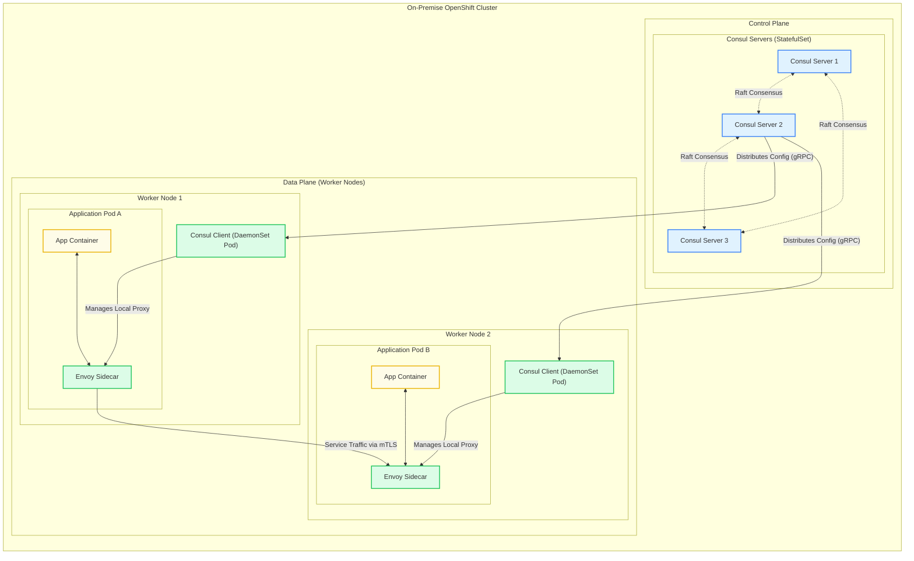
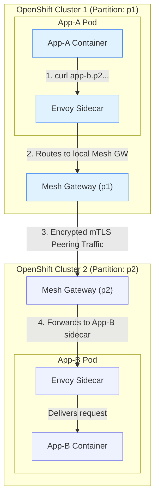

Service Mesh Architecture Playbook
A Guide for the Core Banking Cell-Based Architecture on OpenShift

Introduction
This playbook provides the definitive architectural guide for implementing, securing, and operating the HashiCorp Consul service mesh for the Core Banking platform. The platform's Cell-Based Architecture, which distributes services across multiple on-premise OpenShift clusters, requires a robust and secure networking layer. This document outlines the logical architecture, security model, routing strategy, and operational procedures for the service mesh that underpins this platform.

1. Service Mesh Logical Architecture
(Addresses Action Item: Service Mesh Architecture Playbook)

The service mesh provides the connectivity, security, and resiliency for all services within and across the banking cells. The architecture is designed for high availability and multi-datacenter disaster recovery.

1.1. Logical Layers & Resiliency
The architecture is composed of two primary datacenters, East (dc1) and West (dc2), operating in an active-passive model for disaster recovery. Within each datacenter, multiple OpenShift clusters host the various banking cells (Retail, Corporate, Paylah, Common).

Control Plane: Each of the eight OpenShift clusters runs its own independent, highly-available Consul control plane (deployed as a StatefulSet). This ensures cluster autonomy and resilience.

Data Plane: A Consul client agent runs on every worker node (as a DaemonSet), and an Envoy sidecar proxy is injected into every application pod to form the data plane.

Cluster Peering: The Consul control planes across all clusters are interconnected using Consul Cluster Peering. This creates a single, unified service mesh, allowing any service to securely discover and communicate with any other service, regardless of its location.

Gateways:

Ingress Gateways are the entry point for all external traffic into the mesh.

Mesh Gateways are the dedicated exit/entry points for all cross-cluster traffic, ensuring all communication between OpenShift clusters is secure and encrypted.

1.2. Architectural Diagrams
Core Consul Components within a Single Cluster 



Cross-Cluster Communication Flow Cross


2. Service Mesh Security and Authentication
(Addresses Action Item: Service Mesh Security and Authentication)

The service mesh implements a zero-trust security model by default. All communication is denied unless explicitly permitted, and all permitted traffic is automatically encrypted.

Server-to-Server Authentication: All communication between services within the mesh is authenticated and encrypted using automatic mutual TLS (mTLS). The Consul control plane acts as a Certificate Authority (CA) for each cluster, automatically issuing, distributing, and rotating certificates for every service. This provides a strong, verifiable identity for every workload.

Application-to-Database Communication: For services inside the mesh that need to communicate with traditional databases or other services outside the mesh, a Consul Terminating Gateway is used. This provides a secure, controlled, and observable exit point from the mesh. The gateway can be configured to manage TLS origination to the external service and integrate with a secrets management tool like HashiCorp Vault for handling database credentials securely.

Access Controls (Intentions): Authorization is managed through Consul Intentions. Intentions are rules that define which services are allowed to communicate. The policy is deny-by-default. An administrator must create an "allow" intention to permit traffic between a source service (e.g., api-gateway) and a destination service (e.g., accounts-service). This is enforced at L4, but can be extended with L7 policies for method-level access control.

3. Service Mesh Message Routing
(Addresses Action Item: Service Mesh Message Routing)

The core routing challenge is to direct incoming API requests to the correct cell based on complex business logic within the message payload. This is a form of content-based routing that goes beyond simple path or header matching.

Required Message Structure: The routing logic depends on fields within the JSON payload of incoming requests, such as productCode and accountNumber. The message format must be consistent for the routing logic to be applied correctly.

Routing Implementation: This advanced routing is implemented using a custom Lua script deployed as an Envoy filter on the Consul Ingress Gateway. This centralizes the routing intelligence at the edge of the mesh. The script executes a series of rules:

Fast Path Routing: First, it checks for well-known "fast paths" based on the request path or specific payload values (e.g., product codes 010, 391) that map directly to a known cell. This handles high-volume, predictable traffic efficiently.

Dynamic Lookup: If the request does not match a fast path, the script makes an internal, asynchronous call to the Cell Localization Service (CLS) in the Common Cell. The CLS encapsulates the complex business logic to determine the correct destination cell, and the Lua script routes the original request based on the CLS response.

This architecture is detailed in the diagram below.

```mermaid

graph TD
    Client([External Client]) -- "API Request" --> IngressGateway;
    subgraph "On-Premise OpenShift Cluster"
        subgraph "Consul Ingress Gateway"
            IngressGateway("fa:fa-network-wired Ingress Gateway<br/><i>Lua Filter Enforced Here</i>");
        end
        subgraph "Common Cell"
            CLS("Cell Localization Service (CLS)");
            GLS_DB[(GLS DB)];
            CLS -- "Queries" --> GLS_DB;
        end
        subgraph "Retail Cell"
            RetailServices("Retail Banking Services");
        end
        subgraph "Corporate Cell"
            CorporateServices("Corporate Banking Services");
        end
        subgraph "Paylah Cell (Wallet)"
            PaylahServices("Payment & Wallet Services");
        end
        IngressGateway -- "<b>Fast Path Routing</b><br/>(Rules 1-5)" --> RetailServices & CorporateServices & PaylahServices;
        IngressGateway -- "<b>Dynamic Lookup</b><br/>(Rule 6)" --> CLS;
        CLS -.->|"<b>Response</b><br/>(Rule 7)"| IngressGateway;
        IngressGateway -.->|"<b>Routes based on CLS response</b>"| RetailServices & CorporateServices & PaylahServices;
    end
    classDef client fill:#f3e8ff,stroke:#8b5cf6;
    classDef ingress fill:#e0f2fe,stroke:#3b82f6,stroke-width:2px;
    classDef common fill:#fefce8,stroke:#eab308,stroke-width:2px;
    classDef cell fill:#dcfce7,stroke:#22c55e,stroke-width:1px,color:#15803d;
    class Client client;
    class IngressGateway ingress;
    class CLS,GLS_DB common;
    class RetailServices,CorporateServices,PaylahServices cell;
``````

4. Service Mesh Maintenance and Upgrade Scenarios
(Addresses Action Item: Service Mesh Maintenance and Upgrade Scenarios)

Operational readiness requires well-defined procedures for maintenance and upgrades. The service mesh architecture is designed to allow for these activities with zero downtime to the applications.

Upgrade Scenario: Upgrading the Consul service mesh is a multi-step, non-disruptive process managed via the official Helm chart.

Control Plane Upgrade: First, the Consul servers (control plane) are upgraded. The StatefulSet performs a rolling update, ensuring the control plane remains available throughout.

Data Plane Upgrade: Next, the application Deployments are triggered for a rolling restart. This is necessary so that the pods are re-injected with the new version of the Envoy sidecar. The rolling update strategy ensures that application availability is maintained.

Gateway Upgrade: The Ingress, Mesh, and Terminating Gateways are also upgraded via a rolling update.

Observability for Maintenance: Before, during, and after any maintenance activity, observability is key. The service mesh provides critical data:

Metrics: The Envoy proxies export a rich set of metrics (request volume, latency, success/error rates) to a central Prometheus instance. These metrics are visualized in Grafana dashboards. Operators monitor these dashboards to ensure the mesh is healthy and to validate the success of an upgrade by watching for any increase in error rates.

Health Checks: Consul's own health checks continuously monitor the status of the control plane and all services, providing a clear view of mesh health.

Handling Services Outside the Mesh: As described in the security section, Terminating Gateways are the mechanism for securely managing communication with services that are not part of the mesh. During maintenance of an external service, traffic can be temporarily shifted away from it using Consul's traffic management CRDs if a backup is available, or the services attempting to reach it can rely on Consul's circuit breaking to gracefully handle the failure.
