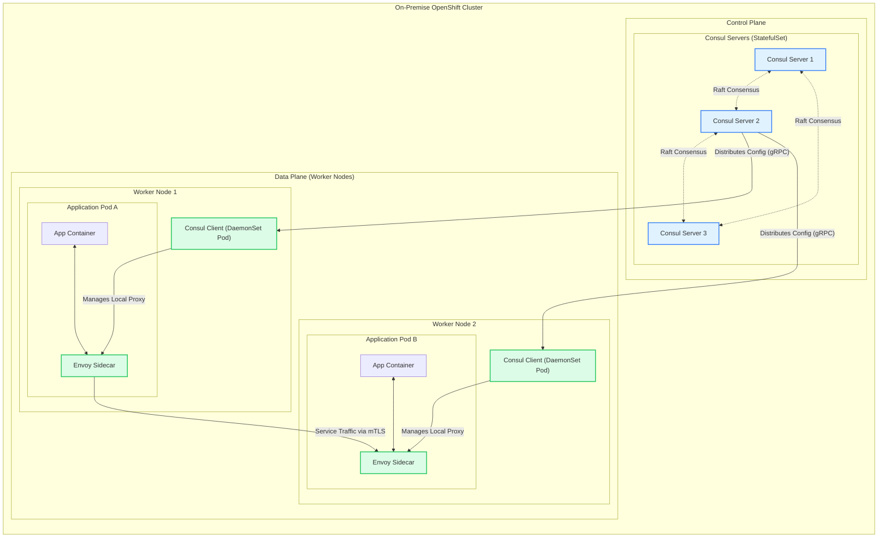
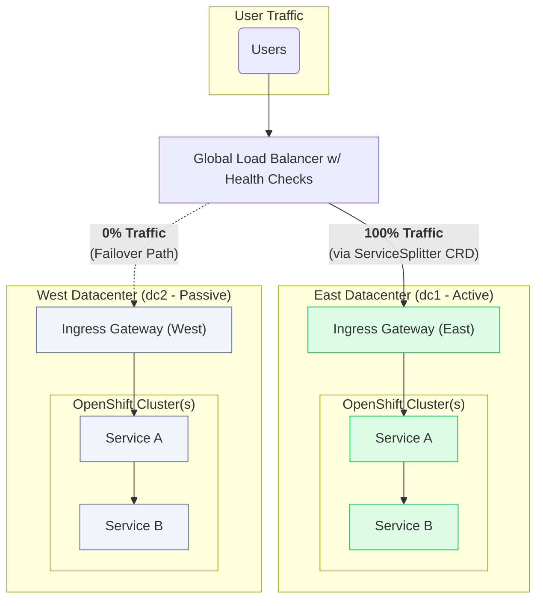
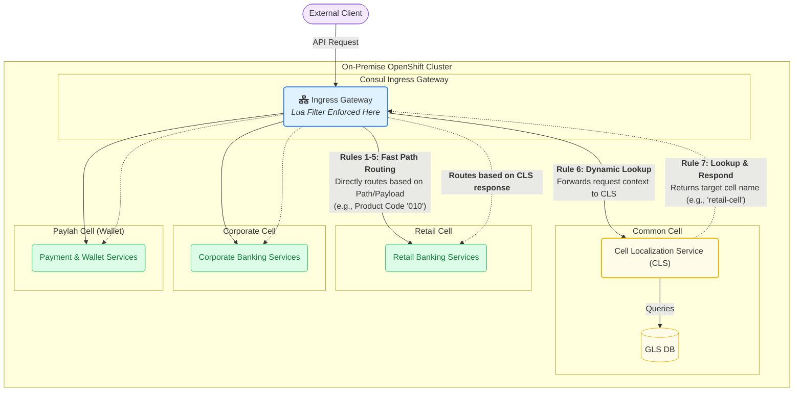

Implementing a Service Mesh for a Core Banking Cell-Based Architecture with Consul
1. Overview: The Need for a Service Mesh in a Cell-Based Architecture
Modernizing a core banking platform often involves adopting a Cell-Based Architecture. This pattern segregates services into logical, domain-oriented "cells" (e.g., Retail, Corporate, Payments, and a Common cell for shared services) which can be deployed and scaled independently, often across multiple on-premise OpenShift clusters for high availability and disaster recovery.

This distributed architecture introduces significant networking and security challenges:

How do we intelligently route traffic to the correct cell based on complex business logic?

How do we enforce strict security boundaries, ensuring services in one cell cannot improperly access another?

How do we maintain a global, real-time registry of all services across all cells and datacenters?

How can we encrypt all communication between services automatically?

How do we ensure the entire system is resilient to failures within a cell or an entire datacenter?

This document outlines the architecture for solving these challenges by implementing HashiCorp Consul as a service mesh. Consul provides a consistent control plane for networking, security, and resiliency across the entire cell-based platform running on OpenShift.

2. The Role of the Service Mesh in Supporting Cells
A service mesh provides the critical infrastructure layer that enables a cell-based architecture to function securely and efficiently.

Service Registry & Discovery: In a multi-cell architecture spanning different OpenShift clusters, a globally aware service registry is essential. Consul provides a central catalog that tracks the real-time health and location of every service in every cell, accessible via both DNS and a rich HTTP API.

Load Balancing: Consul's Envoy sidecar proxies provide advanced Layer 7 load balancing. This ensures that traffic is intelligently distributed among service instances within a cell, improving performance and resilience.

Automatic mTLS Encryption: Consul Connect automatically secures all traffic between services, both within the same cell and across different cells. It manages the entire certificate lifecycle, providing a foundational layer of zero-trust security.

Access Control (Intentions): Consul Intentions are used to enforce strict communication boundaries. They operate on a "deny-by-default" principle, meaning you must explicitly define which cells and services are allowed to communicate. For example, an intention can ensure that a service in the Paylah cell cannot call a service in the Corporate cell unless explicitly permitted.

Observability: A service mesh is critical for understanding traffic flows in a complex cell-based architecture. The Envoy proxies export detailed metrics and tracing data, providing deep visibility into the performance and dependencies of inter- and intra-cell communication.

Resiliency Patterns: Consul enables critical resiliency patterns like retries, timeouts, and circuit breaking. These are configured centrally and enforced at the data plane, making the entire platform more resilient to transient failures or service degradation within any given cell.

3. Core Consul Architecture within a Single OpenShift Cluster
To understand the multi-cluster setup, it's essential first to understand how Consul operates within a single OpenShift cluster. The architecture is split into a control plane and a data plane.

The Control Plane: The brain of the service mesh, consisting of a cluster of Consul servers, is deployed as an OpenShift StatefulSet. This provides the stable storage and network identity needed to maintain the mesh's state.

The Data Plane: A Consul client agent is deployed to every OpenShift worker node using a DaemonSet. For each application pod that joins the mesh, a lightweight Envoy sidecar proxy is automatically injected. This proxy intercepts all network traffic to and from the application, enforcing the policies defined by the control plane.

This architecture ensures that the service mesh infrastructure is as resilient as the cell-based applications it supports.


4. Multi-Datacenter Architecture with Cluster Peering
For a multi-datacenter deployment across your East (dc1) and West (dc2) OpenShift clusters, the architecture uses Consul Cluster Peering. This modern approach connects the otherwise independent Consul control planes, enabling a global view of services while maintaining datacenter autonomy and security.

Each datacenter runs its own set of OpenShift clusters, and each cluster runs its own highly-available Consul control plane. These control planes are then peered with each other. A key concept in this model is the Consul Admin Partition, which provides a way to logically group and isolate services and configurations. In this architecture, each OpenShift cluster's Consul deployment can be configured in its own partition (e.g., p1 for Cluster 1, p2 for Cluster 2).

How Peering Works: Instead of replicating all data, peering uses efficient RPC forwarding to query for remote information on demand. This makes the architecture highly scalable and resilient to network partitions.

Mesh Gateways: All traffic between peered clusters is securely routed through Mesh Gateways. These are dedicated Envoy proxies that act as the entry/exit points for all cross-cluster traffic, ensuring it is always encrypted with mTLS.
```mermaid
graph LR
    subgraph "East Datacenter (dc1)"
        direction TB
        subgraph "Consul Servers (East)"
            S_E1["Server E1"]
            S_E2["Server E2"]
            S_E3["Server E3"]
        end
        S_E1 <-.->|"LAN Gossip"| S_E2
        S_E2 <-.->|"LAN Gossip"| S_E3
        MGE["Mesh Gateway (East)"]
    end

    subgraph "West Datacenter (dc2)"
        direction TB
        subgraph "Consul Servers (West)"
            S_W1["Server W1"]
            S_W2["Server W2"]
            S_W3["Server W3"]
        end
        S_W1 <-.->|"LAN Gossip"| S_W2
        S_W2 <-.->|"LAN Gossip"| S_W3
        MGW["Mesh Gateway (West)"]
    end

    S_E1 <-->|"Cluster Peering (mTLS)"| S_W1
    S_E2 <-->|"Cluster Peering (mTLS)"| S_W2

    style MGE fill:#dcfce7,stroke:#22c55e
    style MGW fill:#dcfce7,stroke:#22c55e

The Cross-Cluster Communication Flow
When a service in one cluster needs to communicate with a service in another, Consul manages the request flow seamlessly and securely.

Request Initiation: An application (App-A) in Cluster 1 initiates a request to the fully qualified domain name (FQDN) of a remote service, such as http://app-b.p2.service.consul. The .p2 in the name tells Consul the service resides in the p2 partition (Cluster 2).

Local Routing: The Envoy sidecar in App-A's pod intercepts the request. It queries its local Consul agent, which determines that the destination is in a peered cluster. The sidecar then routes the request to its local Mesh Gateway.

Secure Transit: The Mesh Gateway in Cluster 1 establishes a secure mTLS connection with the Mesh Gateway in Cluster 2 and forwards the request over this encrypted tunnel.

Final Delivery: The Mesh Gateway in Cluster 2 receives the traffic, decrypts it, and forwards it to the Envoy sidecar of a healthy App-B pod, which then delivers the request to the application container.

```mermaid
graph TD
    subgraph "OpenShift Cluster 1 (Partition: p1)"
        direction TB
        subgraph "App-A Pod"
            AppA["App-A Container"] -- "1. curl app-b.p2..." --> SidecarA["Envoy Sidecar"]
        end
        SidecarA -- "2. Routes to local Mesh GW" --> MeshGW1["Mesh Gateway (p1)"]
    end

    subgraph "OpenShift Cluster 2 (Partition: p2)"
        direction TB
        MeshGW2["Mesh Gateway (p2)"] -- "4. Forwards to App-B sidecar" --> SidecarB["Envoy Sidecar"]
        subgraph "App-B Pod"
             SidecarB -- "Delivers request" --> AppB["App-B Container"]
        end
    end

    MeshGW1 -- "3. Encrypted mTLS Peering Traffic" --> MeshGW2

    classDef cluster1 fill:#e0f2fe,stroke:#3b82f6
    classDef cluster2 fill:#eef2ff,stroke:#6366f1
    class AppA,SidecarA,MeshGW1 cluster1
    class AppB,SidecarB,MeshGW2 cluster2

```

5. Resiliency and Disaster Recovery
For a mission-critical banking platform, the architecture must tolerate failures ranging from a single pod to an entire datacenter.

The Global Load Balancer (GLB)
In front of the two datacenters sits a Global Load Balancer (GLB). This is a DNS-based routing service responsible for directing end-user traffic to the active datacenter. The GLB relies on health checks that continuously monitor application availability in both East and West. If the health checks for the East datacenter fail, the GLB automatically updates its DNS records to send all traffic to the West, automating the user-facing aspect of a failover.

Active-Passive Failover with Consul CRDs
The primary disaster recovery model is active-passive. This is managed declaratively using Consul's native OpenShift CRDs:

ServiceResolver: This CRD logically partitions services into subsets based on their location (e.g., a dc1 subset and a dc2 subset).

ServiceSplitter: This CRD controls the traffic flow. In normal operation, it is configured to route 100% of traffic to the dc1 subset. During a DR event, an operator or automation simply updates this CRD to route 100% of traffic to the dc2 subset.



6. Advanced Routing for Cell Localization
The core challenge is routing an incoming request to the correct cell (Retail, Corporate, or Paylah) based on business logic. This is achieved by deploying a custom Lua script as an Envoy filter on the Consul Ingress Gateway. This script acts as an intelligent, centralized router at the edge of the mesh.

For each incoming request, it performs two stages of logic:

Fast Path Routing: It first inspects the request path and payload for well-known identifiers (e.g., specific product codes or account prefixes) that map directly to a destination cell.

Dynamic Lookup: If the request doesn't match a fast path, the script makes an internal call to the Cell Localization Service (CLS) in the Common Cell. The CLS encapsulates the complex business logic to determine the correct destination, and the Lua script routes the original request based on the CLS response.

This advanced routing logic is defined in an external script and declaratively applied to the Ingress Gateway using Consul's CRDs, centralizing the routing intelligence and decoupling clients from the internal service topology.

The Lua script that implements this logic can be found in the accompanying cell_router.lua file.

The script is deployed by applying it to the gateway via a Consul CRD, as shown in the ingress_gateway.yaml example.


